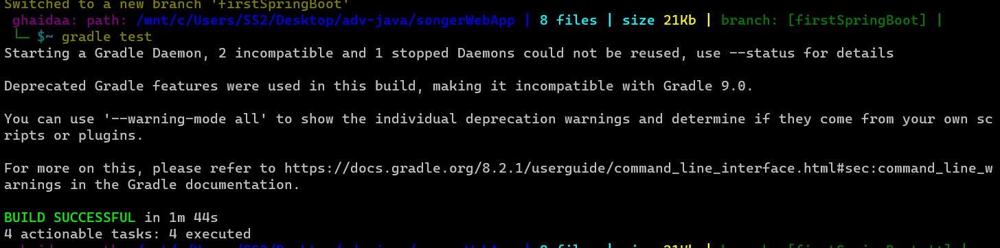

# Songr Web Application

Songr is a web application that allows users to explore music albums and capitalize words. It includes several routes to access different functionalities.

## Getting Started

- Clone the repository
- Navigate to the project directory
- Create a database and then add your properties to `applicaiton.properties` file 
- Run the application 

---

## Usage

1. After running the application, open a web browser and go to `http://localhost:8080`
2. Use the navigation links to access the different pages:
- `Hello Page` for a personalized greeting, by this rout `/hello`
- `Capitalize Page` to capitalize words, by this rout `/capitalize/{word}`, here you can add any word you want to be capitalized
- `Albums Page` to explore music albums, by this rout `/albums`, and here you as a user you can as many albums as you want, and inside this you can add songs to a specific album
- `Song Page` to explore all the songs in the system
- `Album Details Page` this page will give you all the information about a specific album along with the songs that the album contain

---

### Testing output on CMD for lab11

